# End-to-End Azure Data Engineering Project - E-commerce Analytics

#### A comprehensive data engineering project implementing a production-grade data pipeline using Azure services, processing Brazilian e-commerce data through a Medallion architecture.

## Project Highlights

**Complex Data Ingestion:** Parameterized ADF pipelines handling 8 datasets from 3 different sources (HTTP, MySQL, MongoDB).   
**Medallion Architecture:** Bronze → Silver → Gold layers with incremental data quality improvement.   
**Distributed Processing:** PySpark transformations on 100K+ records with joins, aggregations, and enrichment.   
**Enterprise Security:** Service Principal authentication, IAM roles, OAuth2 token-based access.  
**Production Patterns:** ForEach loops, dynamic content, lookup activities, batch processing optimization.  

## Architecture

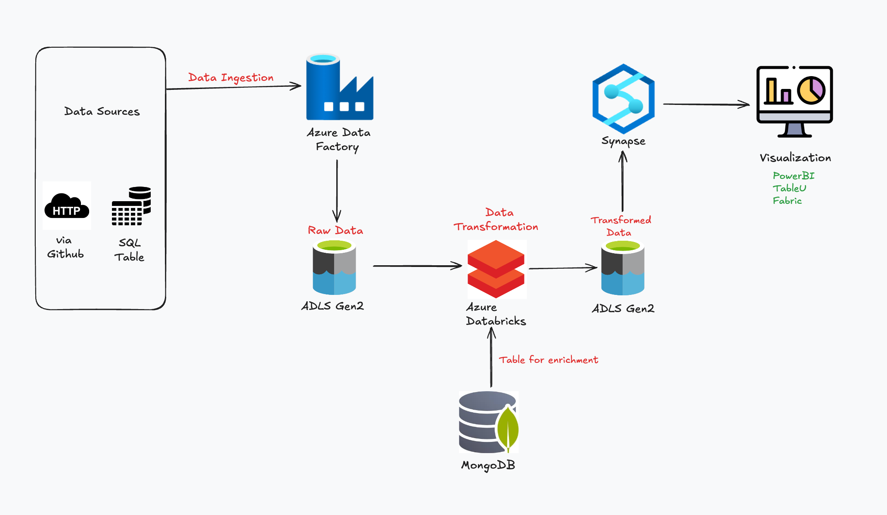

## Technical Skills:

Azure Data Factory (Advanced)

✅ Parameterized pipelines using JSON configuration files
✅ ForEach activities with dynamic content expressions (@item(), @activity())
✅ Lookup activities for metadata-driven ingestion
✅ Linked Services management (HTTP, MySQL, ADLS Gen2)
✅ Copy Activity optimization with parallel processing
✅ Pipeline monitoring and debugging strategies

📸 Screenshot: ADF pipeline showing ForEach loop with nested Copy activities

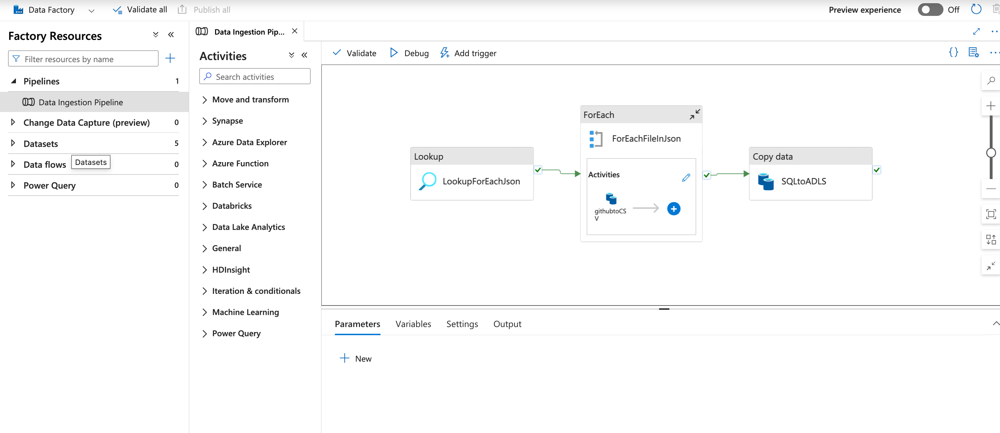

## Medallion Architecture

**Bronze Layer:** Raw data ingestion (as-is from sources)  
**Silver Layer:** Cleaned and transformed data  
**Gold Layer:** Business-level aggregations and analytics-ready data  

📸 Screenshot Suggestion: Diagram showing Bronze → Silver → Gold flow

## ADLS Gen2 (Data Lake Engineering)

✅ Hierarchical namespace for folder structure  
✅ Medallion Architecture implementation  
✅ Access control with IAM roles (Storage Blob Data Contributor)  
✅ File format optimization (CSV → Parquet, compression)  
✅ Partition strategies for query performance  

## Technologies Used

### 1. Azure Services

**Azure Data Factory** - ETL/ELT orchestration  
**Azure Data Lake Storage Gen2** - Scalable data lake with hierarchical namespace  
**Azure Databricks** - Apache Spark-based distributed processing.   
**Azure Synapse Analytics** - Data warehousing and analytics  

### 2. Databases

**MySQL (filess.io)** - Relational data source  
**MongoDB (filess.io)** - NoSQL data enrichment  

### 3. Languages & Tools

Python - Data manipulation and scripting  
PySpark - Distributed data transformation  
SQL - Data querying and external tables  
📸 Screenshot: Technology stack diagram or icons  

### Prerequisites

#### Required Skills

- Basic understanding of Python and SQL  
- Familiarity with data engineering concepts  
- Motivation to learn and complete the project!  

Required Accounts

1. Azure Account (Free with 200$ available)

$200 credits valid for 30 days

2. Free Database Hosting (filess.io)

📸  Screenshot: Filess.io page showing both MySQL and MongoDB hosted.

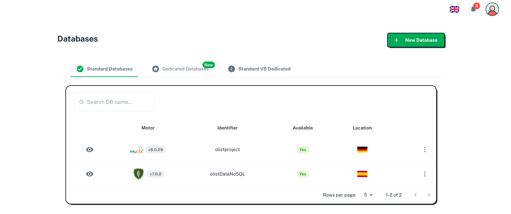

- 100% free forever plan
- 10MB per database (sufficient for this project)
- Supports both MySQL and MongoDB

## 📊 Data Sources

### Dataset: Olist Brazilian E-commerce

📸 Screenshot: Kaggle dataset page

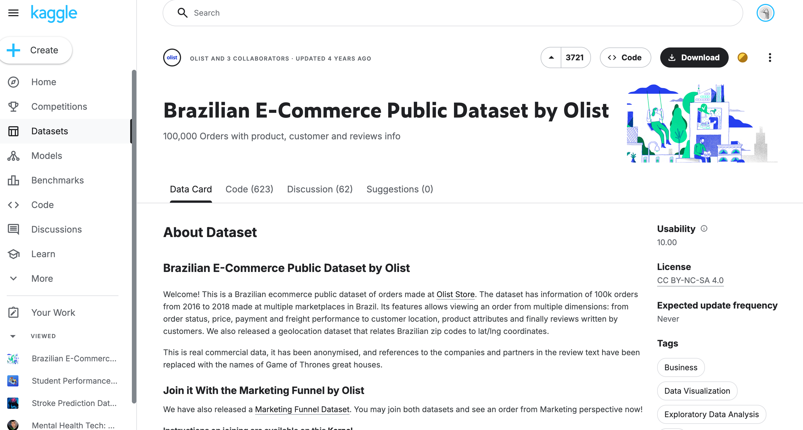

**Source:** [Kaggle - Brazilian E-commerce Dataset](https://www.kaggle.com/datasets/olistbr/brazilian-ecommerce)

**Why This Dataset?**
- 100K+ real orders from Brazilian marketplace
- 8 interconnected CSV files (realistic complexity)
- Multiple relationships (customers, orders, payments, reviews)
- Sufficient size for demonstrating big data concepts

### Data Files Structure

**📸 Screenshot: Data schema**
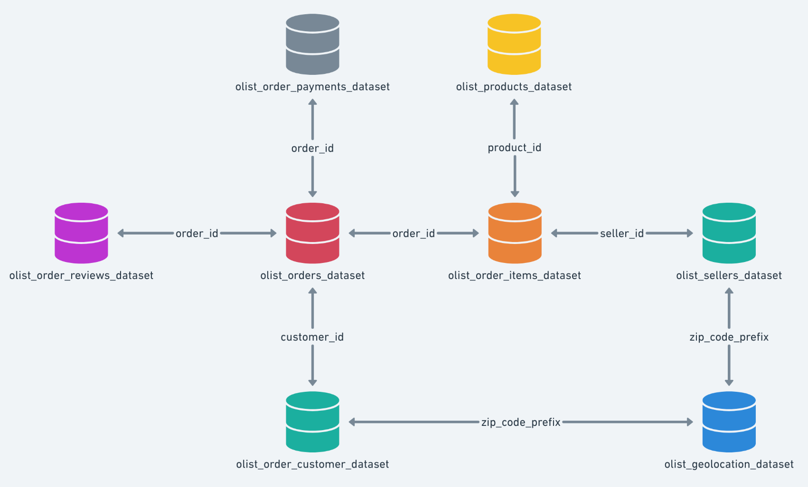

| File | Records | Storage Location |
|------|---------|------------------|
| `olist_customers_dataset.csv` | ~99K | GitHub (HTTP) |
| `olist_orders_dataset.csv` | ~99K | GitHub (HTTP) |
| `olist_order_items_dataset.csv` | ~112K | GitHub (HTTP) |
| `olist_order_payments_dataset.csv` | ~103K | **MySQL Database** |
| `olist_products_dataset.csv` | ~32K | GitHub (HTTP) |
| `olist_sellers_dataset.csv` | ~3K | GitHub (HTTP) |
| `olist_geolocation_dataset.csv` | ~1M | GitHub (HTTP) |
| `product_category_translation.csv` | ~71 | **MongoDB Database** |

## Project Implementation Phases

### Phase 1: Azure Foundation & Resource Setup

**Objective**: - Establish cloud infrastructure with proper resource hierarchy and Medallion Architecture.

**Key Actions**

- Created Azure Free Tier account with $200 credits
- Established resource group: ecom-life in Central India region
- Provisioned ADLS Gen2 storage account
- Critical: Enabled Hierarchical Namespace for folder support
- Configured LRS (Locally Redundant Storage) for cost optimization
- Created container with Medallion Architecture structure:

**📸 Screenshot: Resource Group**
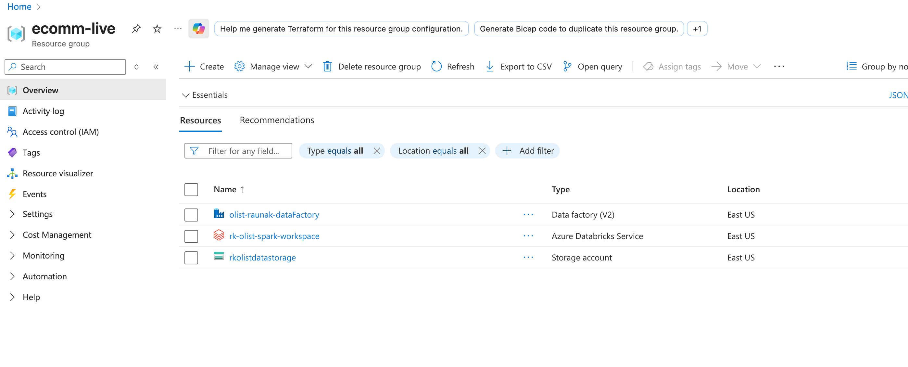 

**📸 Screenshot: Container structure**
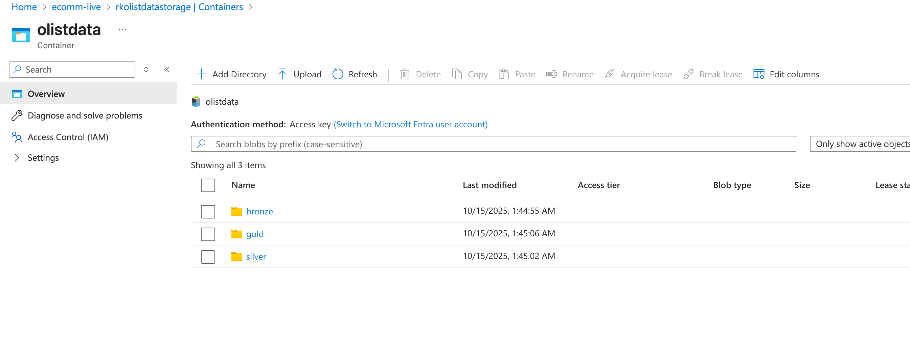

- bronze/ - Raw data ingestion
- silver/ - Cleaned/validated data
- gold/ - Aggregated business metrics

### Phase 2: Multi-Database Configuration
**Objective**:- Configure heterogeneous data sources simulating real-world polyglot persistence.

**Key Actions**

MySQL Setup (filess.io)

- Created cloud-hosted database
- Uploaded olist_order_payments_dataset.csv (103K records)
- Implemented batch processing (500 records/batch) to overcome memory limits

MongoDB Setup (filess.io)

- Created NoSQL database
- Collection: product_categories (71 documents)
- Purpose: Data enrichment for category translations

**📸 Screenshot: SQL DB Web Client**
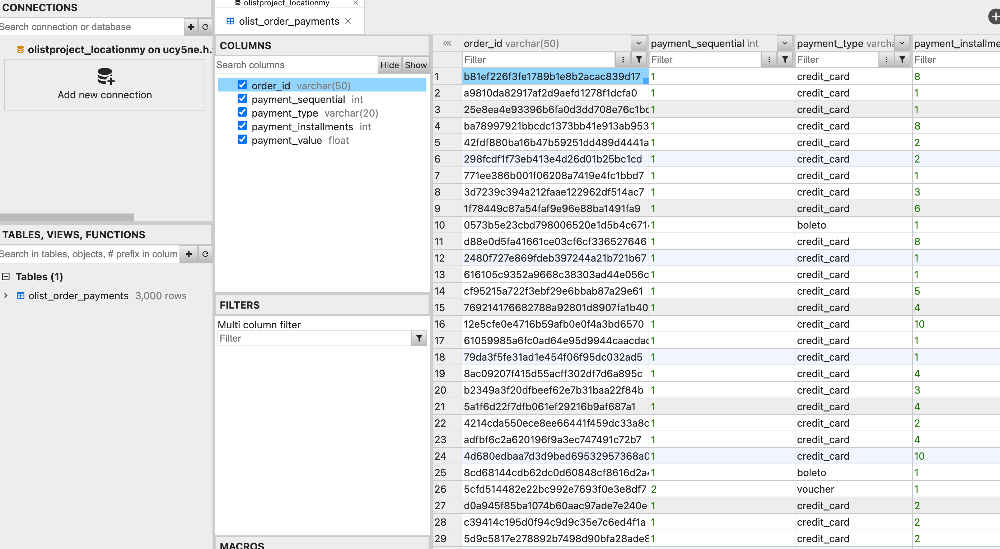 

**📸 Screenshot: MongoDB web Client**
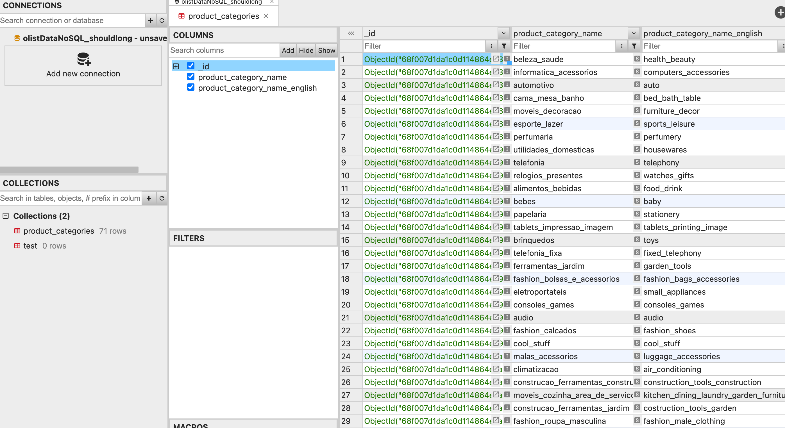

### Phase 3: Azure Data Factory - Parameterized ETL

**Objective**: - Build scalable, metadata-driven ingestion pipeline handling multiple sources dynamically.

**Key Actions**

**Linked Services Configuration**

- HTTP Linked Service: GitHub repository connection
- MySQL Linked Service: External database connection
- ADLS Gen2 Linked Service: Data lake sink

**Parameterized Pipeline Architecture**

- Created for_each_input.json configuration file (8 datasets)
- Lookup Activity: Reads configuration from GitHub at runtime
- ForEach Activity: Iterates over configuration array using `@activity('Lookup').output.value`
- Copy Data Activity: Dynamic expressions for source/sink
    - Source: `@item().csv_relative_url`
    - Sink: `@item().file_name`
- Separate pipeline for MySQL→ADLS transfer

**Execution & Validation**

- Debug mode testing
- Monitored all 8 datasets landing in bronze layer
- Published production-ready pipeline

**📸 Screenshot: Pipeline Definition**

**📸 Screenshot: Linked Service**
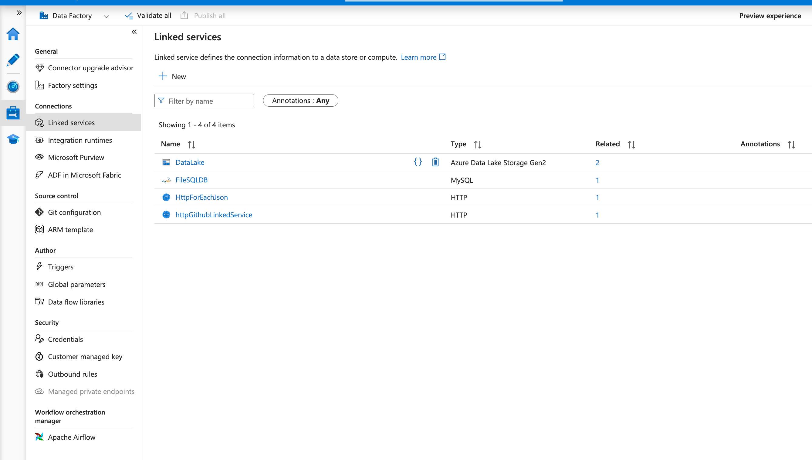

**📸 Screenshot: ForEachLoop**
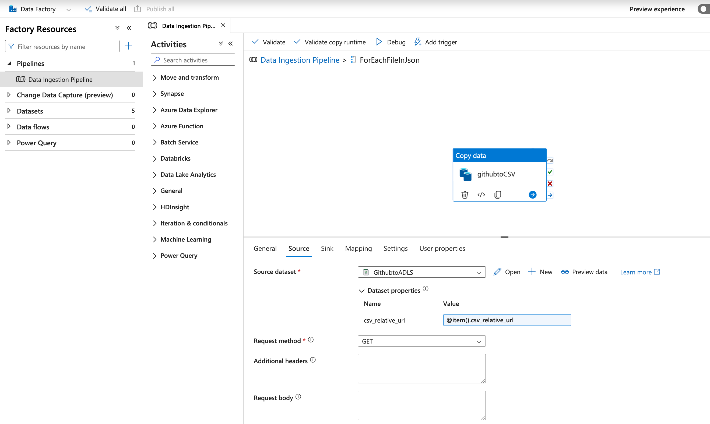

**📸 Screenshot: Pipeline debugged and Published**
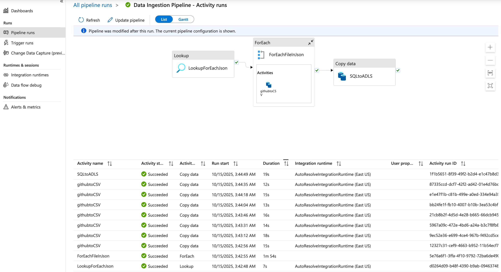

**📸 Screenshot: Data Ingested in Storage(Container)**
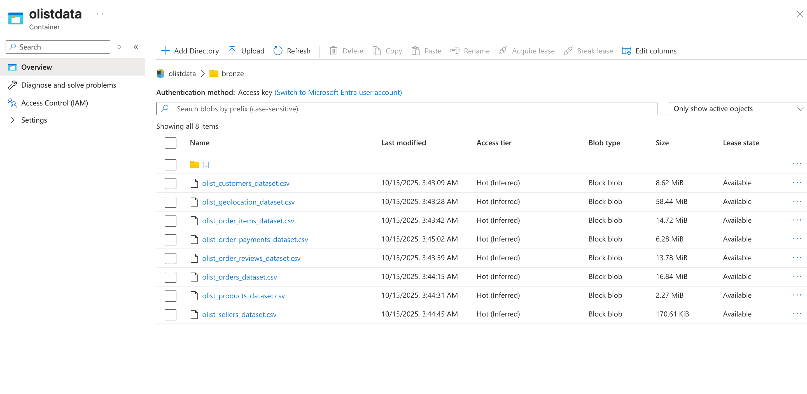

### Phase 4: Databricks - Distributed Processing

**Objective**:- Implement complex PySpark transformations with enterprise security and performance optimization.

**Key Actions**

**Infrastructure Setup**

- Created Premium Databricks workspace
- Configured cluster: Databricks 14.3 LTS, 4 cores, 16GB RAM
- Enabled Photon acceleration and auto-termination (20 min)

**Service Principal Authentication**

- Created Azure App Registration (Client ID, Tenant ID, Secret)
- Assigned Storage Blob Data Contributor role via IAM
- Configured 5 Spark parameters for OAuth2 authentication
- Challenge overcome: 15-20 min IAM propagation delay

**Data Access & Processing**

- Read 8 datasets from bronze using ABFSS protocol
- Connected to MongoDB for enrichment data (PyMongo)

**Bronze → Silver Transformations**

- Cleaning: Deduplication, null handling, type casting, validation
- Joins: 5+ complex joins (orders+customers+items+products+payments)
- Enrichment: Left join with MongoDB category translations
- Optimization: Broadcast joins for small tables, repartitioning, caching
- Output: Parquet format with Snappy compression to silver layer

**Silver → Gold Transformations**

- Aggregations: Product metrics (revenue, order count, avg price)
- Window functions: Rankings, running totals, moving averages
- Partitioning: Date-based partitions (year/month) for query optimization
- Output: Partitioned Parquet to gold layer

Performance Results

Storage reduction:
Query performance: 

**📸 Screenshot: This code configures Service Principal authentication to access Azure Data Lake Storage Gen2 (ADLS Gen2) from Databricks.**
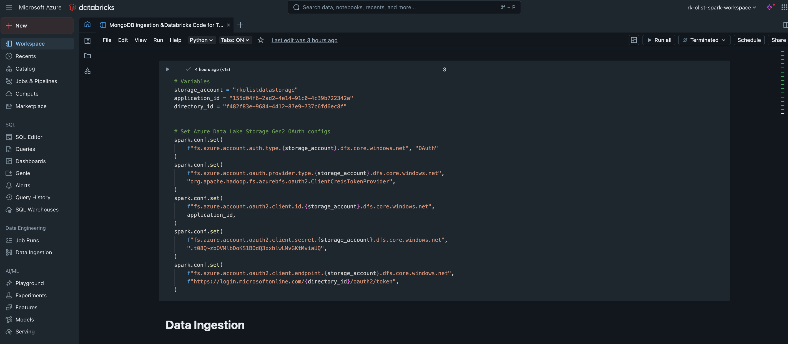

**📸 Screenshot: Data Loaded in Databricks**
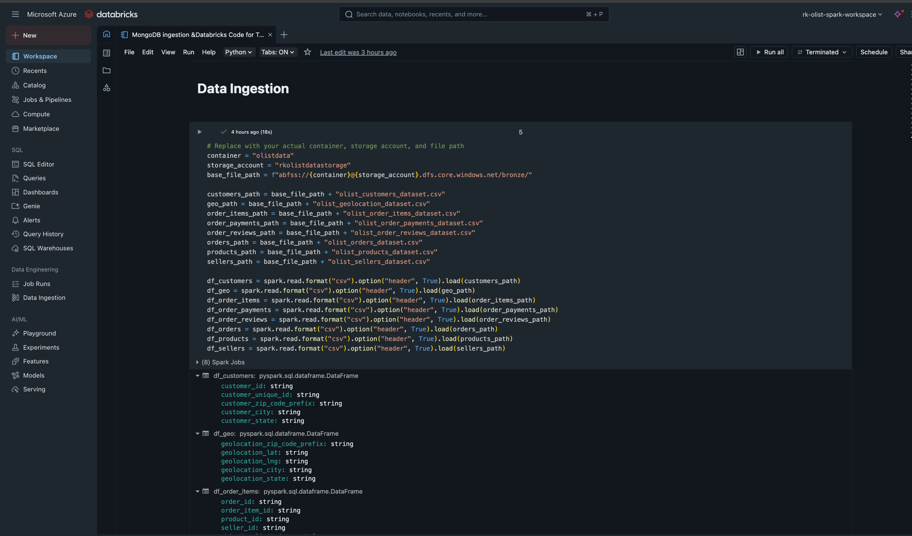

**📸 Screenshot: Performed Data Cleaning**

### Phase 5: Synapse Analytics - Serving Layer (**DEV IN PROGRESS**)

**Objective**: - Create analytics-ready serving layer with external tables for BI tools.
